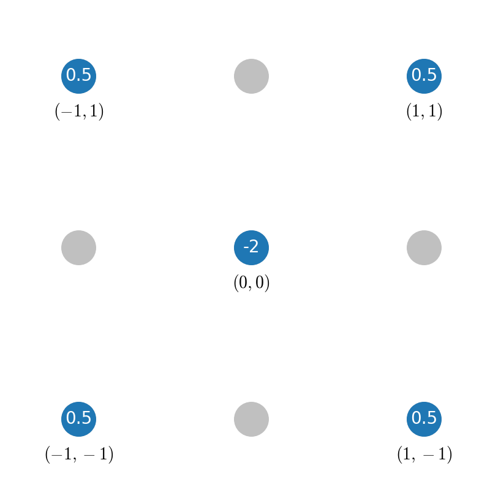
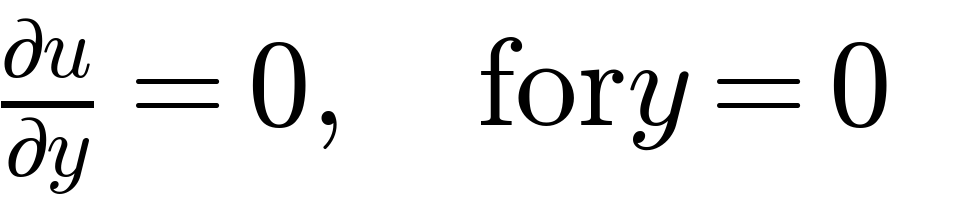

#  findiff
[](https://badge.fury.io/py/findiff)


[](https://findiff.readthedocs.io/en/latest/index.html)
[]()
[](https://pepy.tech/project/findiff)


A Python package for finite difference numerical derivatives and partial differential equations in
any number of dimensions. 

## Main Features

* Differentiate arrays of any number of dimensions along any axis with any desired accuracy order
* Accurate treatment of grid boundary
* Can handle arbitrary linear combinations of derivatives with constant and variable coefficients
* Fully vectorized for speed
* Matrix representations of arbitrary linear differential operators
* Solve partial differential equations with Dirichlet or Neumann boundary conditions


## Installation

```
pip install --upgrade findiff
```

## Documentation and Examples

You can find the documentation of the code including examples of application at https://findiff.readthedocs.io/en/latest/.


## Taking Derivatives

*findiff* allows to easily define derivative operators that you can apply to *numpy* arrays of any dimension.
The syntax for a simple derivative operator is 

```python
FinDiff(axis, spacing, degree)
```

where `spacing` is the separation of grid points between neighboring grid points. Consider the 1D case
with a first derivative  along the only axis (0):

```
import numpy as np

x = np.linspace(0, 1, 100)
f = np.sin(x)  # as an example

# Define the derivative:
d2_dx2 = FinDiff(0, dx, 1)

# Apply it:
d2f_dx2 = d2_dx2(f) 
```

Similary, you can define partial derivative operators along different axes or of higher degree, for example:

| Math                                                  | *findiff*                             |                                        |
|-------------------------------------------------------|---------------------------------------|----------------------------------------|
|      | ```FinDiff(1, dy, 1)```               | same as ``` FinDiff(1, dy)```          |
|    | ```FinDiff(1, dy, 4)```               | any degree is possible                 |
|  | ```FinDiff((0, dx, 2), (2, dz, 1))``` | mixed also possible, one tuple per axis |
|   |  ```FinDiff(10, dx10, 1)```           | number of axes not limited             |

We can also take linear combinations of derivative operators, for example:


is

```python
Coef(2*X) * FinDiff((0, dz, 2), (2, dz, 1)) + Coef(3*sin(Y)*Z**2) * FinDiff((0, dx, 1), (1, dy, 2))
```

where `X, Y, Z` are *numpy* arrays with meshed grid points.

Chaining differential operators is also possible, e.g.


can be written as

```python
(FinDiff(0, dx) - FinDiff(1, dy)) * (FinDiff(0, dx) + FinDiff(1, dy))
```

and

```python
FinDiff(0, dx, 2) - FinDiff(1, dy, 2)
```

Of course, standard operators from vector calculus like gradient, divergence and curl are also available
as shortcuts.

More examples can be found [here](https://maroba.github.io/findiff-docs/source/examples.html) and in [this blog](https://medium.com/p/7e54132a73a3).

### Accuracy Control

When constructing an instance of `FinDiff`, you can request the desired accuracy
order by setting the keyword argument `acc`. For example:

```
d2_dx2 = findiff.FinDiff(0, dy, 2, acc=4)
d2f_dx2 = d2_dx2(f)
```

If not specified, second order accuracy will be taken by default.


## Finite Difference Coefficients

Sometimes you may want to have the raw finite difference coefficients.
These can be obtained for __any__ derivative and accuracy order
using `findiff.coefficients(deriv, acc)`. For instance,

```python
import findiff
coefs = findiff.coefficients(deriv=3, acc=4, symbolic=True)
```

gives

```
{'backward': {'coefficients': [15/8, -13, 307/8, -62, 461/8, -29, 49/8],
              'offsets': [-6, -5, -4, -3, -2, -1, 0]},
 'center': {'coefficients': [1/8, -1, 13/8, 0, -13/8, 1, -1/8],
            'offsets': [-3, -2, -1, 0, 1, 2, 3]},
 'forward': {'coefficients': [-49/8, 29, -461/8, 62, -307/8, 13, -15/8],
             'offsets': [0, 1, 2, 3, 4, 5, 6]}}
```

If you want to specify the detailed offsets instead of the
accuracy order, you can do this by setting the offset keyword
argument:

```python
import findiff
coefs = findiff.coefficients(deriv=2, offsets=[-2, 1, 0, 2, 3, 4, 7], symbolic=True)
```

The resulting accuracy order is computed and part of the output:

```
{'coefficients': [187/1620, -122/27, 9/7, 103/20, -13/5, 31/54, -19/2835], 
 'offsets': [-2, 1, 0, 2, 3, 4, 7], 
 'accuracy': 5}
```

## Matrix Representation

For a given _FinDiff_ differential operator, you can get the matrix representation 
using the `matrix(shape)` method, e.g. for a small 1D grid of 10 points:

```python
d2_dx2 = FinDiff(0, dx, 2)
mat = d2_dx2.matrix((10,))  # this method returns a scipy sparse matrix
print(mat.toarray())
``` 

has the output

```
[[ 2. -5.  4. -1.  0.  0.  0.]
 [ 1. -2.  1.  0.  0.  0.  0.]
 [ 0.  1. -2.  1.  0.  0.  0.]
 [ 0.  0.  1. -2.  1.  0.  0.]
 [ 0.  0.  0.  1. -2.  1.  0.]
 [ 0.  0.  0.  0.  1. -2.  1.]
 [ 0.  0.  0. -1.  4. -5.  2.]]
```


## Stencils

*findiff* uses standard stencils (patterns of grid points) to evaluate the derivative.
However, you can design your own stencil. A picture says more than a thousand words, so
look at the following example for a standard second order accurate stencil for the 
2D Laplacian :


This can be reproduced by *findiff* writing

```
offsets = [(0, 0), (1, 0), (-1, 0), (0, 1), (0, -1)]
stencil = Stencil(offsets, partials={(2, 0): 1, (0, 2): 1}, spacings=(1, 1))
```

The attribute `stencil.values` contains the coefficients

```
{(0, 0): -4.0, (1, 0): 1.0, (-1, 0): 1.0, (0, 1): 1.0, (0, -1): 1.0}
```

Now for a some more exotic stencil. Consider this one:



With *findiff* you can get it easily:

```
offsets = [(0, 0), (1, 1), (-1, -1), (1, -1), (-1, 1)]
stencil = Stencil(offsets, partials={(2, 0): 1, (0, 2): 1}, spacings=(1, 1))
stencil.values
```
which returns

```
{(0, 0): -2.0, (1, 1): 0.5, (-1, -1): 0.5, (1, -1): 0.5, (-1, 1): 0.5}
```

## Partial Differential Equations

_findiff_ can be used to easily formulate and solve partial differential equation problems

<p align="center">

</p>

where _L_ is a general linear differential operator.
 
In order to obtain a unique solution,  Dirichlet, Neumann or more general boundary conditions
can be applied.

### Boundary Value Problems

#### Example 1: 1D forced harmonic oscillator with friction

Find the solution of 

<p align="center">

</p>

subject to the (Dirichlet) boundary conditions

<p align="center">

</p>


```python
from findiff import FinDiff, Id, PDE

shape = (300, )
t = numpy.linspace(0, 10, shape[0])
dt = t[1]-t[0]

L = FinDiff(0, dt, 2) - FinDiff(0, dt, 1) + Coef(5) * Id()
f = numpy.cos(2*t)

bc = BoundaryConditions(shape)
bc[0] = 0
bc[-1] = 1

pde = PDE(L, f, bc)
u = pde.solve()
```

Result:

<p align="center">

</p>

#### Example 2: 2D heat conduction

A plate with temperature profile given on one edge and zero heat flux across the other
edges, i.e.

<p align="center">

</p>

with Dirichlet boundary condition

<p align="center">

</p>

and Neumann boundary conditions

<p align="center">

</p>
<p align="center">

</p>


```python
shape = (100, 100)
x, y = np.linspace(0, 1, shape[0]), np.linspace(0, 1, shape[1])
dx, dy = x[1]-x[0], y[1]-y[0]
X, Y = np.meshgrid(x, y, indexing='ij')

L = FinDiff(0, dx, 2) + FinDiff(1, dy, 2)
f = np.zeros(shape)

bc = BoundaryConditions(shape)
bc[1,:] = FinDiff(0, dx, 1), 0  # Neumann BC
bc[-1,:] = 300. - 200*Y   # Dirichlet BC
bc[:, 0] = 300.   # Dirichlet BC
bc[1:-1, -1] = FinDiff(1, dy, 1), 0  # Neumann BC

pde = PDE(L, f, bc)
u = pde.solve()
```

Result:

<p align="center">

</p>

## Development

### Set up development environment

- Fork the repository
- Clone your fork to your machine
- Install in development mode:

```
python setup.py develop
```

### Running tests

From the console:

```
python -m unittest discover test
```


