# findiff
[](https://badge.fury.io/py/findiff)

A Python package for finite difference numerical derivatives and partial differential equations in
any number of dimensions. 

## Features ##

* Differentiate arrays of any number of dimensions along any axis with any desired accuracy order
* Accurate treatment of grid boundary
* Includes standard operators from vector calculus like gradient, divergence and curl
* Can handle uniform and non-uniform grids
* Can handle arbitrary linear combinations of derivatives with constant and variable coefficients
* Fully vectorized for speed
* Calculate raw finite difference coefficients for any order and accuracy for uniform and non-uniform grids
* _New in version 0.7:_ Generate matrix representations of arbitrary linear differential operators
* _New in version 0.8:_ Solve __partial differential equations__ with Dirichlet or Neumann boundary conditions


## Installation

```
pip install findiff
```

## Derivatives

_findiff_ works in any number of dimensions. But for the sake of demonstration, suppose you
want to differentiate a four-dimensional function given on a 4D array `f` with coordinates `x, y, z, u`.

For , where <i>x</i> denotes the 0-th axis, we can write

```python
# define operator
d_dx = FinDiff(0, dx)

# apply operator
df_dx = d_dx(f)
# df_dx is now an array of the same shape as f containing the partial derivative
```
The partial derivative , where <i>z</i> means the 2nd axis, is

```python
d_dz = FinDiff(2, dz)
df_dz = d_dz(f)
```

Higher derivatives like
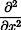  or 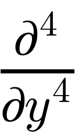
can be defined like this:

```python
# the derivative order is the third argument
d2_dx2 = FinDiff(0, dx, 2)
d2f_dx2 = d2_dx2(f)

d4_dy4 = FinDiff(1, dy, 4)
d4f_dy4 = d4_dy4(f)
```

Mixed partial derivatives like 
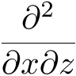 or 
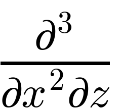


```python
d2_dxdz = FinDiff((0, dx), (2, dz))
d2_dxdz(f)

d3_dx2dz = FinDiff((0, dx, 2), (2, dz))
```

Linear combinations of differential operators like

<p align="center">
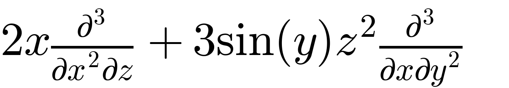
</p>

can be written as

```python
from numpy import meshgrid, sin
X, Y, Z, U = meshgrid(x, y, z, u, indexing="ij")
diff_op = Coef(2*X) * FinDiff((0, dz, 2), (2, dz, 1)) + Coef(3*sin(Y)*Z**2) * FinDiff((0, dx, 1), (1, dy, 2))
```

Chaining differential operators is also possible, e.g.

<p align="center">
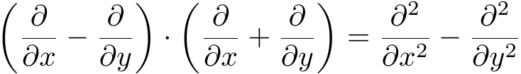
</p>

```python
diff_op = (FinDiff(0, dx) - FinDiff(1, dy)) * (FinDiff(0, dx) + FinDiff(1, dy))
# is equivalent to
diff_op2 = FinDiff(0, dx, 2) - FinDiff(1, dy, 2)
```

Standard operators from vector calculus like gradient, divergence and curl are also available, for example:

```python
grad = Gradient(h=[dx, dy, dz, du])
grad_f = grad(f)
```

More examples can be found [here](https://maroba.github.io/findiff-docs/source/examples.html).


### Derivatives in N dimensions

The package can work with any number of dimensions, the generalization
of usage is straight forward. The only limit is memory and CPU speed.

### Accuracy Control

When constructing an instance of `FinDiff`, you can request the desired accuracy
order by setting the keyword argument `acc`. 

```
d2_dx2 = findiff.FinDiff(0, dy, 2, acc=4)
d2f_dx2 = d2_dx2(f)
```

If not specified, second order accuracy will be taken by default.


### Finite Difference Coefficients

Sometimes you may want to have the raw finite difference coefficients.
These can be obtained for __any__ derivative and accuracy order
using `findiff.coefficients(deriv, acc)`. For instance,

```python
import findiff
coefs = findiff.coefficients(deriv=2, acc=2)
```

gives

```
{ 'backward': {'coefficients': array([-1.,  4., -5.,  2.]),
               'offsets': array([-3, -2, -1,  0])},
  'center': {'coefficients': array([ 1., -2.,  1.]),
             'offsets': array([-1,  0,  1])},
  'forward': {'coefficients': array([ 2., -5.,  4., -1.]),
              'offsets': array([0, 1, 2, 3])}
              }
```

FinDiff operators will use central coefficients whenever possible and switch
to backward or forward coefficients if not enough points are available on either side.

### Matrix Representation

For a given _FinDiff_ differential operator, you can get the matrix representation 
using the `matrix(shape)` method, e.g.

```python
x = [np.linspace(0, 6, 7)]
d2_dx2 = FinDiff(0, x[1]-x[0], 2)
u = x**2

mat = d2_dx2.matrix(u.shape)  # this method returns a scipy sparse matrix
print(mat.toarray())
``` 

has the output

```
[[ 2. -5.  4. -1.  0.  0.  0.]
 [ 1. -2.  1.  0.  0.  0.  0.]
 [ 0.  1. -2.  1.  0.  0.  0.]
 [ 0.  0.  1. -2.  1.  0.  0.]
 [ 0.  0.  0.  1. -2.  1.  0.]
 [ 0.  0.  0.  0.  1. -2.  1.]
 [ 0.  0.  0. -1.  4. -5.  2.]]
```

The same works for differential operators in higher dimensions. Of course, you can
use this matrix to perform the differentiation manually by matrix-vector multiplication:

```python
d2u_dx2 = mat.dot(u.reshape(-1))
```

### Stencils

You can also take a look at the finite difference stencils, e.g. for a 2D grid:

```python
import numpy as np
from findiff import FinDiff

x, y = np.linspace(0, 1, 100)
X, Y = np.meshgrid(x, y, indexing='ij')
u = X**3 + Y**3
laplace_2d = FinDiff(0, x[1]-x[0], 2) + FinDiff(1, y[1]-y[0], 2)

stencil = laplace_2d.stencil(u.shape)

print(stencil)
```

yields the following output

```
('L', 'L'):	{(0, 0): 4.0, (1, 0): -5.0, (2, 0): 4.0, (3, 0): -1.0, (0, 1): -5.0, (0, 2): 4.0, (0, 3): -1.0}
('L', 'C'):	{(0, 0): 0.0, (1, 0): -5.0, (2, 0): 4.0, (3, 0): -1.0, (0, -1): 1.0, (0, 1): 1.0}
('L', 'H'):	{(0, 0): 4.0, (1, 0): -5.0, (2, 0): 4.0, (3, 0): -1.0, (0, -3): -1.0, (0, -2): 4.0, (0, -1): -5.0}
('C', 'L'):	{(-1, 0): 1.0, (0, 0): 0.0, (1, 0): 1.0, (0, 1): -5.0, (0, 2): 4.0, (0, 3): -1.0}
('C', 'C'):	{(-1, 0): 1.0, (0, 0): -4.0, (1, 0): 1.0, (0, -1): 1.0, (0, 1): 1.0}
('C', 'H'):	{(-1, 0): 1.0, (0, 0): 0.0, (1, 0): 1.0, (0, -3): -1.0, (0, -2): 4.0, (0, -1): -5.0}
('H', 'L'):	{(-3, 0): -1.0, (-2, 0): 4.0, (-1, 0): -5.0, (0, 0): 4.0, (0, 1): -5.0, (0, 2): 4.0, (0, 3): -1.0}
('H', 'C'):	{(-3, 0): -1.0, (-2, 0): 4.0, (-1, 0): -5.0, (0, 0): 0.0, (0, -1): 1.0, (0, 1): 1.0}
('H', 'H'):	{(-3, 0): -1.0, (-2, 0): 4.0, (-1, 0): -5.0, (0, 0): 4.0, (0, -3): -1.0, (0, -2): 4.0, (0, -1): -5.0}
```

This is a dictionary with the characteristic points as keys and the stencils as values. 
The 2D grid has 3**2 = 9 "characteristic points", so it has 9 stencils.

'L' stands for 'lowest index' (which is 0), 'H' for 'highest index' (which is the number of points on the given axis minus 1)
and 'C' for 'center', i.e. a grid point not at the boundary of the axis.

In 2D the characteristic points are center points ('C', 'C'), corner points: ('L', 'L'), ('L', 'H'), ('H', 'L'), ('H', 'H')
and edge-points (all others). For N > 2 dimensions the characteristic points are 3**N analogous tuples with N indices each.

Each stencil is a dictionary itself with the index offsets as keys and the finite difference coefficients as values.

In order to apply the stencil manually, you can use

```
lap_u = stencil.apply_all(u)
``` 

which iterates over all grid points, selects the right right stencil and applies it.

## Partial Differential Equations

_findiff_ can be used to easily formulate and solve partial differential equation problems

<p align="center">
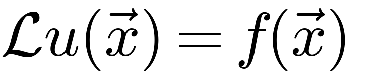
</p>

where _L_ is a general linear differential operator.
 
In order to obtain a unique solution,  Dirichlet, Neumann or more general boundary conditions
can be applied.

### Boundary Value Problems

#### Example 1: 1D forced harmonic oscillator with friction

Find the solution of 

<p align="center">
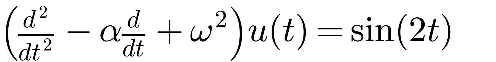
</p>

subject to the (Dirichlet) boundary conditions

<p align="center">
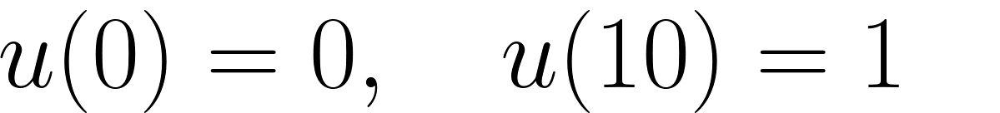
</p>


```python
from findiff import FinDiff, Id, PDE

shape = (300, )
t = numpy.linspace(0, 10, shape[0])
dt = t[1]-t[0]

L = FinDiff(0, dt, 2) - FinDiff(0, dt, 1) + Coef(5) * Id()
f = numpy.cos(2*t)

bc = BoundaryConditions(shape)
bc[0] = 0
bc[-1] = 1

pde = PDE(L, f, bc)
u = pde.solve()
```

Result:

<p align="center">
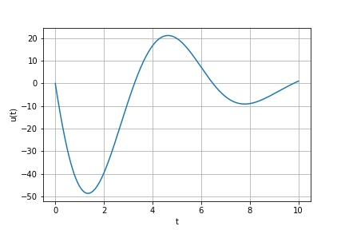
</p>

#### Example 2: 2D heat conduction

A plate with temperature profile given on one edge and zero heat flux across the other
edges, i.e.

<p align="center">
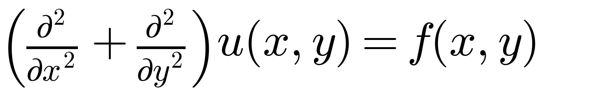
</p>

with Dirichlet boundary condition

<p align="center">
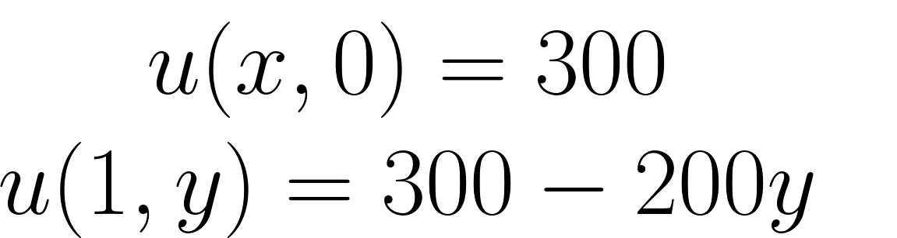
</p>

and Neumann boundary conditions

<p align="center">

</p>


```python
shape = (100, 100)
x, y = np.linspace(0, 1, shape[0]), np.linspace(0, 1, shape[1])
dx, dy = x[1]-x[0], y[1]-y[0]
X, Y = np.meshgrid(x, y, indexing='ij')

L = FinDiff(0, dx, 2) + FinDiff(1, dy, 2)
f = np.zeros(shape)

bc = BoundaryConditions(shape)
bc[1,:] = FinDiff(0, dx, 1), 0  # Neumann BC
bc[-1,:] = 300. - 200*Y   # Dirichlet BC
bc[:, 0] = 300.   # Dirichlet BC
bc[1:-1, -1] = FinDiff(1, dy, 1), 0  # Neumann BC

pde = PDE(L, f, bc)
u = pde.solve()
```

Result:

<p align="center">
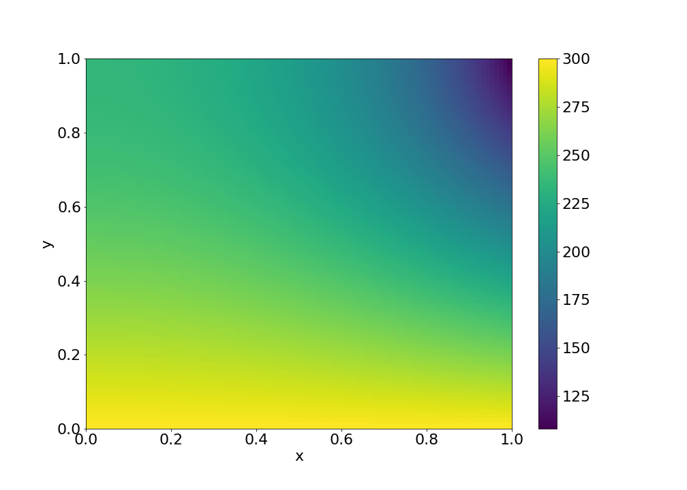
</p>


## Compatibility

Currently `findiff` only supports Python 3.

## Documentation and Examples

You can find the documentation of the code including examples of application at https://maroba.github.io/findiff-docs/index.html.

## Dependencies

_findiff_ uses _numpy_ for fast array processing and _scipy_ for sparse matrix support.


