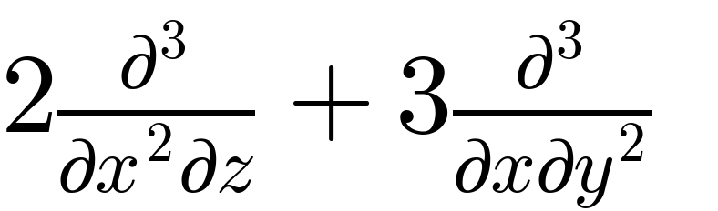

# findiff
[](https://badge.fury.io/py/findiff)

A Python package for finite difference numerical derivatives in
any number of dimensions. 

## Features ##

* Differentiate arrays of any number of dimensions along any axis
* Partial derivatives of any desired order
* Any accuracy order can be specified
* Accurate treatment of grid boundary
* Includes standard operators from vector calculus like gradient, divergence and curl
* Can handle uniform and non-uniform grids
* Can handle arbitrary linear combinations of derivatives with constant and variable coefficients
* Fully vectorized for speed
* Calculate raw finite difference coefficients for any order and accuracy for uniform and non-uniform grids

## Quickstart

_findiff_ works in any number of dimensions. But for the sake of demonstration, suppose you
want to differentiate a four-dimensional function given on a 4D array `f` with coordinates `x, y, z, u`.

For , where <i>x</i> denotes the 0-th axis, we can write

```python
# define operator
d_dx = FinDiff(0, dx)

# apply operator
df_dx = d_dx(f)
# df_dx is now an array of the same shape as f containing the partial derivative
```
The partial derivative , where <i>z</i> means the 2nd axis, is

```python
d_dz = FinDiff(2, dz)
df_dz = d_dz(f)
```

Higher derivatives like
  or 
can be defined like this:

```python
# the derivative order is the third argument
d2_dx2 = FinDiff(0, dx, 2)
d2f_dx2 = d2_dx2(f)

d4_dy4 = FinDiff(1, dy, 4)
d4f_dy4 = d4_dy4(f)
```

Mixed partial derivatives like 
 or 


```python
d2_dxdz = FinDiff((0, dx), (2, dz))
d2_dxdz(f)

d3_dx2dz = FinDiff((0, dx, 2), (2, dz))
```

You can also create linear combinations of differential operators like
<p align="center">

</p>

```python
diff_op = Coef(2) * FinDiff((0, dx, 2), (2, dz, 1)) + Coef(3) * FinDiff((0, dx, 1), (1, dy, 2))
```
and more general with variable coefficients like

<p align="center">

</p>
is

```python
from numpy import meshgrid, sin
X, Y, Z, U = meshgrid(x, y, z, u, indexing="ij")
diff_op = Coef(2*X) * FinDiff((0, dz, 2), (2, dz, 1)) + Coef(3*sin(Y)*Z**2) * FinDiff((0, dx, 1), (1, dy, 2))
```

Chaining differential operators is also possible, e.g.

<p align="center">

</p>

```python
diff_op = (FinDiff(0, dx) - FinDiff(1, dy)) * (FinDiff(0, dx) + FinDiff(1, dy))
# is equivalent to
diff_op2 = FinDiff(0, dx, 2) - FinDiff(1, dy, 2)
```

Standard operators from vector calculus like gradient, divergence and curl are also available, for example:

```python
grad = Gradient(h=[dx, dy, dz, du])
grad_f = grad(f)
```

More examples, including linear combinations with variable coefficients can be found [here](https://maroba.github.io/findiff-docs/source/examples.html).


#### Derivatives in N dimensions

The package can work with any number of dimensions, the generalization
of usage is straight forward. The only limit is memory and CPU speed.

#### Accuracy Control

When constructing an instance of `FinDiff`, you can request the desired accuracy
order by setting the keyword argument `acc`. 

```
d2_dx2 = findiff.FinDiff(0, dy, 2, acc=4)
d2f_dx2 = d2_dx2(f)
```

If not specified, second order accuracy will be taken by default.


#### Finite Difference Coefficients

Sometimes you may want to have the raw finite difference coefficients.
These can be obtained for __any__ derivative and accuracy order
using `findiff.coefficients(deriv, acc)`. For instance,

```python
import findiff
coefs = findiff.coefficients(deriv=2, acc=2)
```

gives

```
{ 'backward': {'coefficients': array([-1.,  4., -5.,  2.]),
               'offsets': array([-3, -2, -1,  0])},
  'center': {'coefficients': array([ 1., -2.,  1.]),
             'offsets': array([-1,  0,  1])},
  'forward': {'coefficients': array([ 2., -5.,  4., -1.]),
              'offsets': array([0, 1, 2, 3])}
              }
```

FinDiff operators will use central coefficients whenever possible and switch
to backward or forward coefficients if not enough points are available to either side.

## Installation

Simply use pip:

```
pip install findiff
```

## Compatibility

Currently `findiff` only supports Python 3.

## Documentation and Examples

You can find the documentation of the code including examples of application at https://maroba.github.io/findiff-docs/index.html.

## Dependencies

_findiff_ uses _numpy_ for fast array processing.

