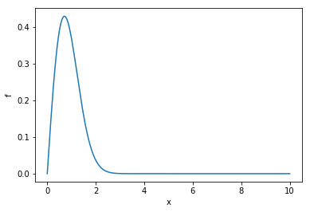
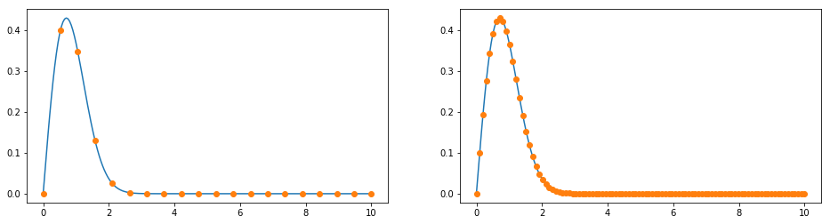
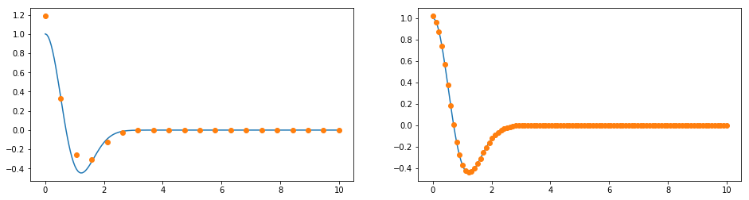
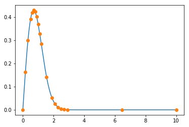
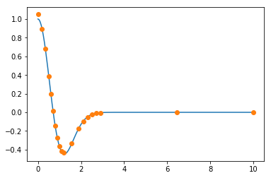

Non-Uniform Grids
=================

.. code:: ipython3

    %matplotlib inline
    import numpy as np
    from findiff import Diff
    import matplotlib.pyplot as plt

We define a function of one variable and its first derivative for this
tutorial.

.. code:: ipython3

    def f(x):
        return x * np.exp(-x**2)
    
    def df_dx(x):
        return np.exp(-x**2) - 2*x**2*np.exp(-x**2)

It looks like this:

.. code:: ipython3

    x_fine = np.linspace(0, 10, 200)
    f_fine = f(x_fine)
    
    plt.plot(x_fine, f_fine)
    plt.xlabel("x")
    plt.ylabel("f")

.. parsed-literal::

    Text(0,0.5,'f')

Let's make a coarse and a finer grid.

.. code:: ipython3

    x1 = np.linspace(0, 10, 20)
    x2 = np.linspace(0, 10, 100)
    f1 = f(x1)
    f2 = f(x2)
    
    fig = plt.figure(figsize=(16,4))
    ax1 = fig.add_subplot(121)
    ax2 = fig.add_subplot(122)
    
    ax1.plot(x_fine, f_fine)
    ax2.plot(x_fine, f_fine)
    ax1.plot(x1, f1, 'o')
    ax2.plot(x2, f2, 'o')

.. parsed-literal::

    [<matplotlib.lines.Line2D at 0x106513e48>]

Obviously the coarser grid covers the function in the range
:math:`x \in [3, 10]` quite well, but not so for :math:`x<3`. Let's
calculate the first derivative for both grids.

.. code:: ipython3

    dx1 = x1[1] - x1[0]
    dx2 = x2[1] - x2[0]
    
    d_dx1 = Diff(0, dx1, acc=2)
    d_dx2 = Diff(0, dx2)
    
    df_dx1 = d_dx1(f1)
    df_dx2 = d_dx2(f2)
    df_dx_exact = df_dx(x_fine)
    
    fig = plt.figure(figsize=(16,4))
    ax1 = fig.add_subplot(121)
    ax2 = fig.add_subplot(122)
    
    ax1.plot(x_fine, df_dx_exact)
    ax2.plot(x_fine, df_dx_exact)
    ax1.plot(x1, df_dx1, 'o')
    ax2.plot(x2, df_dx2, 'o')

.. parsed-literal::

    [<matplotlib.lines.Line2D at 0x106727748>]

We get a big error in the range :math:`x<3` when we calculate the
numerical derivative for the coarse grid. On the other hand, with the
finer grid, we cover the function well on the whole domain, so the error
for the derivative is small. But for :math:`x>3` we waste a lot of grid
points, because the function is boring there. Consequently, we waste
computational power. What we can do is either use the coarse grid and
increase the accuracy order, or, we can use a ***non-uniform*** grid.

.. code:: ipython3

    x_nu = np.r_[np.linspace(0, 0.5, 3, endpoint=False), np.linspace(0.5, 1.2, 7, endpoint=False),              
                 np.linspace(1.2, 1.9, 2, endpoint=False), np.linspace(1.9, 2.9, 5, endpoint=False), 
                 np.linspace(2.9, 10, 3)]
    f_nu = f(x_nu)
    plt.plot(x_fine, f_fine)
    plt.plot(x_nu, f_nu, 'o')

.. parsed-literal::

    [<matplotlib.lines.Line2D at 0x106373e48>]

Note that we have chosen the same number of points (20), but such that
the density is higher where the curvature is higher. Now we calculate
the derivative with the non-uniform grid.

.. code:: ipython3

    d_dx = Diff(0, x_nu, acc=2)
    df_dx_nu = d_dx(f_nu)
    
    plt.plot(x_fine, df_dx_exact)
    plt.plot(x_nu, df_dx_nu, 'o')

.. parsed-literal::

    [<matplotlib.lines.Line2D at 0x1063a9978>]

And the error is much smaller. :-)
