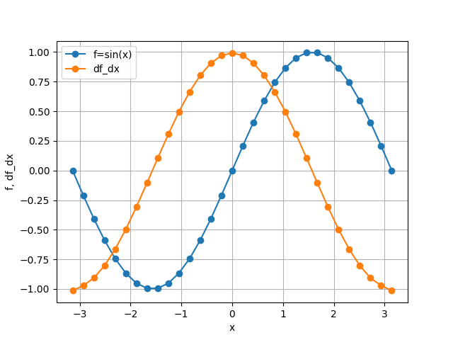
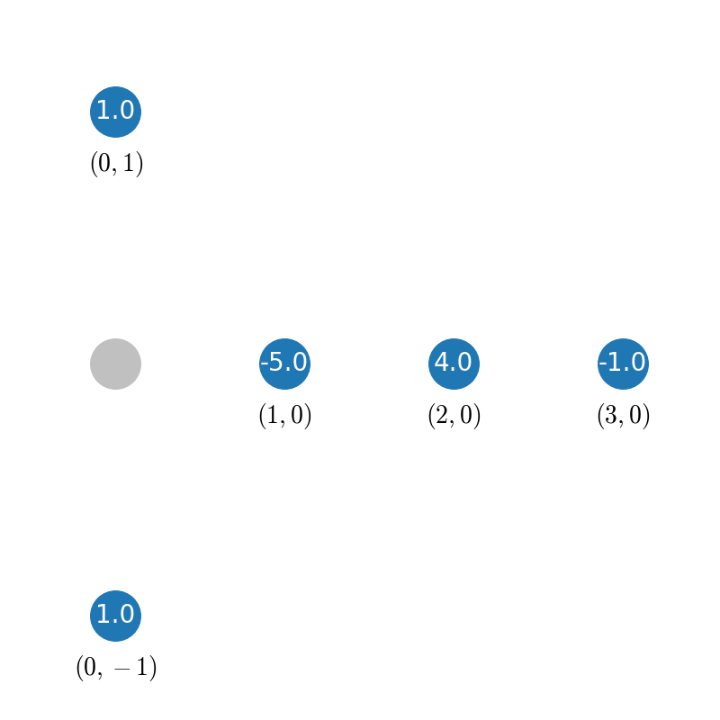

===============
Getting Started
===============

Installation
::::::::::::

.. code-block:: ipython

    pip install --upgrade findiff

Derivatives
:::::::::::

First Derivatives
-----------------

The first derivative along the 0-th axis (":math:`x_0`-axis"),

.. math::

    \frac{\partial}{\partial x_0}\quad,

can be defined by

.. code-block:: ipython

    from findiff import Diff

    d_dx = Diff(0, dx)

The first argument is the **axis** along which to take the partial derivative.
The second argument is the **spacing** of the (equidistant) grid along that axis.

Accordingly, the first partial derivative with respect to the `k`-th axis

.. math:: \frac{\partial}{\partial x_k}

is

.. code-block:: ipython

    Diff(k, dx_k)

Let's initialize a one-dimensional array ``f`` with some values, for example:

.. code-block:: ipython

    import numpy as np
    x = np.linspace(-np.pi, np.pi, 100)
    dx = x[1] - x[0]
    f = np.sin(x)

and calculate the first derivative with respect of the zeroth axis.

``Diff`` objects behave like operators, so in order to apply them, you can
simply call them on a *numpy* ``ndarray`` of any shape:

.. code-block:: ipython

    d_dx = Diff(0, dx)
    df_dx = d_dx(f)

Now ``df_dx`` is a new `numpy` array with the same shape as ``f`` containing the
first derivative with respect to the zeroth axis:

Higher Derivatives
------------------

The `n`-th partial derivatives, say with respect to :math:`x_k`,

.. math:: \frac{\partial^n}{\partial x_k^n}

can be written by exponentation:

.. code-block:: ipython

    Diff(k, dx_k) ** n

A **mixed partial derivatives** like

.. math:: \frac{\partial^3}{\partial x^2 \partial y}

can be written by "multiplication":

.. code-block:: ipython

    Diff(0, dx)**2 * Diff(1, dy)

General Differential Operators
------------------------------

``Diff`` objects can be combined to describe general differential
operators. For example, the wave operator

.. math::

    \frac{1}{c^2}\frac{\partial^2}{\partial t^2} - \frac{\partial^2}{\partial x^2}

can be written as

.. code-block:: ipython

    1 / c**2 * Diff(0, dt)**2 - Diff(1, dx)**2

if the 0-axis represents the `t`-axis and the 1-axis the `x`-axis.

This works both for constant and variable coefficients.

Finally, multiplication of two ``FinDiff`` objects means chaining differential
operators, for example

.. math::

    \left(\frac{\partial}{\partial x} - \frac{\partial}{\partial y}\right) \cdot
    \left(\frac{\partial}{\partial x} + \frac{\partial}{\partial y}\right)
    = \frac{\partial^2}{\partial x^2} - \frac{\partial^2}{\partial y^2}

or in `findiff`:

.. code-block:: ipython

    d_dx = Diff(0, dx)
    d_dy = Diff(1, dy)

    (d_dx - d_dy) * (d_dx + d_dy)

Accuracy Control
----------------

By default, `findiff` uses finite difference schemes with
second order accuracy in the grid spacing. Higher orders can be selected
by setting the keyword argument ``acc``, e.g.

.. code-block:: ipython

    Diff(0, dx, acc=4)

for fourth order accuracy.

Finite Difference Coefficients
::::::::::::::::::::::::::::::

`findiff` uses finite difference schemes to calculate numerical derivatives.
If needed, the finite difference coefficients can be obtained from the
``coefficients`` function, e.g. for second derivative with second order
accuracy:

.. code-block:: ipython

    from findiff import coefficients
    coefficients(deriv=2, acc=2)

which yields

.. code-block:: ipython

       {'backward': {'accuracy': 2,
                     'coefficients': array([-1.,  4., -5.,  2.]),
                     'offsets': array([-3, -2, -1,  0])},
        'center': {'accuracy': 2,
                   'coefficients': array([ 1., -2.,  1.]),
                   'offsets': array([-1,  0,  1])},
        'forward': {'accuracy': 2,
                    'coefficients': array([ 2., -5.,  4., -1.]),
                    'offsets': array([0, 1, 2, 3])}}

Matrix Representations
::::::::::::::::::::::

For a given FinDiff differential operator, you can get the matrix
representation using the matrix(shape) method, e.g.

.. code-block:: ipython

    x = [np.linspace(0, 6, 7)]
    d2_dx2 = Diff(0, x[1]-x[0]) ** 2
    u = x**2

    mat = d2_dx2.matrix(u.shape)  # this method returns a scipy sparse matrix
    print(mat.toarray())

yields

.. code-block:: ipython

    [[ 2. -5.  4. -1.  0.  0.  0.]
     [ 1. -2.  1.  0.  0.  0.  0.]
     [ 0.  1. -2.  1.  0.  0.  0.]
     [ 0.  0.  1. -2.  1.  0.  0.]
     [ 0.  0.  0.  1. -2.  1.  0.]
     [ 0.  0.  0.  0.  1. -2.  1.]
     [ 0.  0.  0. -1.  4. -5.  2.]]

Of course this also works for general differential operators.

Stencils
::::::::

Automatic Stencils
------------------

When you define a differential operator in *findiff*, it automatically
chooses suitable stencils to apply on a given grid. For instance, consider
the 2D Laplacian

.. math::
    \frac{\partial^2}{\partial x^2} + \frac{\partial^2}{\partial y^2}

which can be defined (in second order accuracy here) as

.. code-block:: ipython

    laplacian = Diff(0, dx) ** 2 + Diff(1, dy) ** 2

When you then apply the Laplacian to an array, *findiff* applies it to
all grid points. So depending on the grid point point, *findiff* chooses
on or the other stencil.

You can inspect the stencils for a differential operator by calling
its :code:`stencil` method, passing the shape of the grid

.. code-block:: ipython

    laplacian.stencil(f.shape)

This returns

.. code-block:: shell

    {('L', 'L'): {(0, 0): 4.0, (0, 1): -5.0, (0, 2): 4.0, (0, 3): -1.0, (1, 0): -5.0, (2, 0): 4.0, (3, 0): -1.0},
     ('L', 'C'): {(0, -1): 1.0, (0, 1): 1.0, (1, 0): -5.0, (2, 0): 4.0, (3, 0): -1.0},
     ('L', 'H'): {(0, -3): -1.0, (0, -2): 4.0, (0, -1): -5.0, (0, 0): 4.0, (1, 0): -5.0, (2, 0): 4.0, (3, 0): -1.0},
     ('C', 'L'): {(-1, 0): 1.0, (0, 1): -5.0, (0, 2): 4.0, (0, 3): -1.0, (1, 0): 1.0},
     ('C', 'C'): {(-1, 0): 1.0, (0, -1): 1.0, (0, 0): -4.0, (0, 1): 1.0, (1, 0): 1.0},
     ('C', 'H'): {(-1, 0): 1.0, (0, -3): -1.0, (0, -2): 4.0, (0, -1): -5.0, (0, 0): 0.0, (1, 0): 1.0},
     ('H', 'L'): {(-3, 0): -1.0, (-2, 0): 4.0, (-1, 0): -5.0, (0, 0): 4.0, (0, 1): -5.0, (0, 2): 4.0, (0, 3): -1.0},
     ('H', 'C'): {(-3, 0): -1.0, (-2, 0): 4.0, (-1, 0): -5.0, (0, -1): 1.0, (0, 0): 0.0, (0, 1): 1.0},
     ('H', 'H'): {(-3, 0): -1.0, (-2, 0): 4.0, (-1, 0): -5.0, (0, -3): -1.0, (0, -2): 4.0, (0, -1): -5.0, (0, 0): 4.0}}

In the interior of the grid (the :code:`('C', 'C') case), the stencil looks
like this:

.. image:: images/laplace2d.png
    :width: 400
    :align: center

The blue points denote the grid points used by the stencil, the tu  ple
below denotes the offset from the current grid point and the value
inside the blue dot represents the finite different coefficient for
grid point. So, this stencil evaluates the Laplacian at the center of
the "cross" of blue points. Obviously, this does not work near the boundaries
of the grid because that stencil would require points "outside" of the
grid. So near the boundary, *findiff* switches to asymmetric stencils
(of the same accuracy order), for example

.. image:: images/stencil_laplace2d_corner.png
    :width: 400
    :align: center

for a corner :code:`('L', 'L')`, or

for the left edge :code:`('L', 'C')`.

The :code:`stencil` method works for grids of all dimensions and not just two. But of course,
it is not easy to visualize for higher dimensions.

While :code:`FinDiff` object act on complete arrays, stencils can be applied
to individual grid points, if you just need a numeric derivative evaluated
at one point. For instance,

.. code-block:: ipython

    x = y = np.linspace(0, 1, 101)
    X, Y = np.meshgrid(x, y, indexing='ij')
    f = X**3 + Y**3

    stencils = laplacian.stencil(f.shape)
    stencils.apply(f, (100, 100)) # evaluate at f[100, 100]

returns :code:`12`, as expected. :code:`stencil` returns a list of stencils and
when calling :code:`apply`, the appropriate stencil for the selected grid point
is chosen. In the example, it chooses a stencil for the corner point.

Stencils From Scratch
---------------------

There may be situations when you want to create your own stencils and do not
want to use the stencils automatically created by :code:`FinDiff` objects.
This is mainly for exploratory work. For example, you may wonder, how the
coefficients for the 2D Laplacian look like if you don't use the cross-shaped
stencil from the previous section but rather an x-shaped one:

.. image:: images/laplace2d-x.png
    :width: 400
    :align: center

This can easily be determined with *findiff* by using the :code:`Stencil` class directly:

.. code-block:: ipython

    offsets = [(0, 0), (1, 1), (-1, -1), (1, -1), (-1, 1)] # x-shaped offsets
    stencil = Stencil(offsets, {(2, 0): 1, (0, 2): 1})

returns

.. code-block:: ipython

    {(0, 0): -2.0, (1, 1): 0.5, (-1, -1): 0.5, (1, -1): 0.5, (-1, 1): 0.5}

The second argument of the :code:`Stencil` constructor defines the derivative operator:

.. code-block::

    {(2, 0): 1, (0, 2): 1}

corresponds to

.. math::
    1 \cdot \frac{\partial^2}{\partial x_0} + 1 \cdot \frac{\partial^2}{\partial x_1}.
