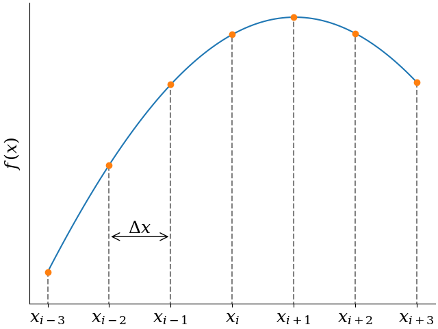
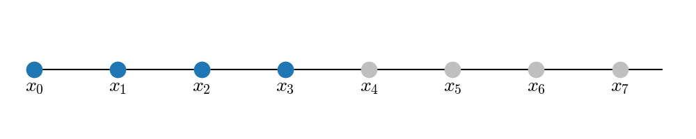
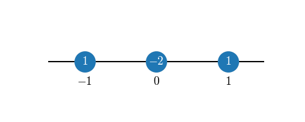
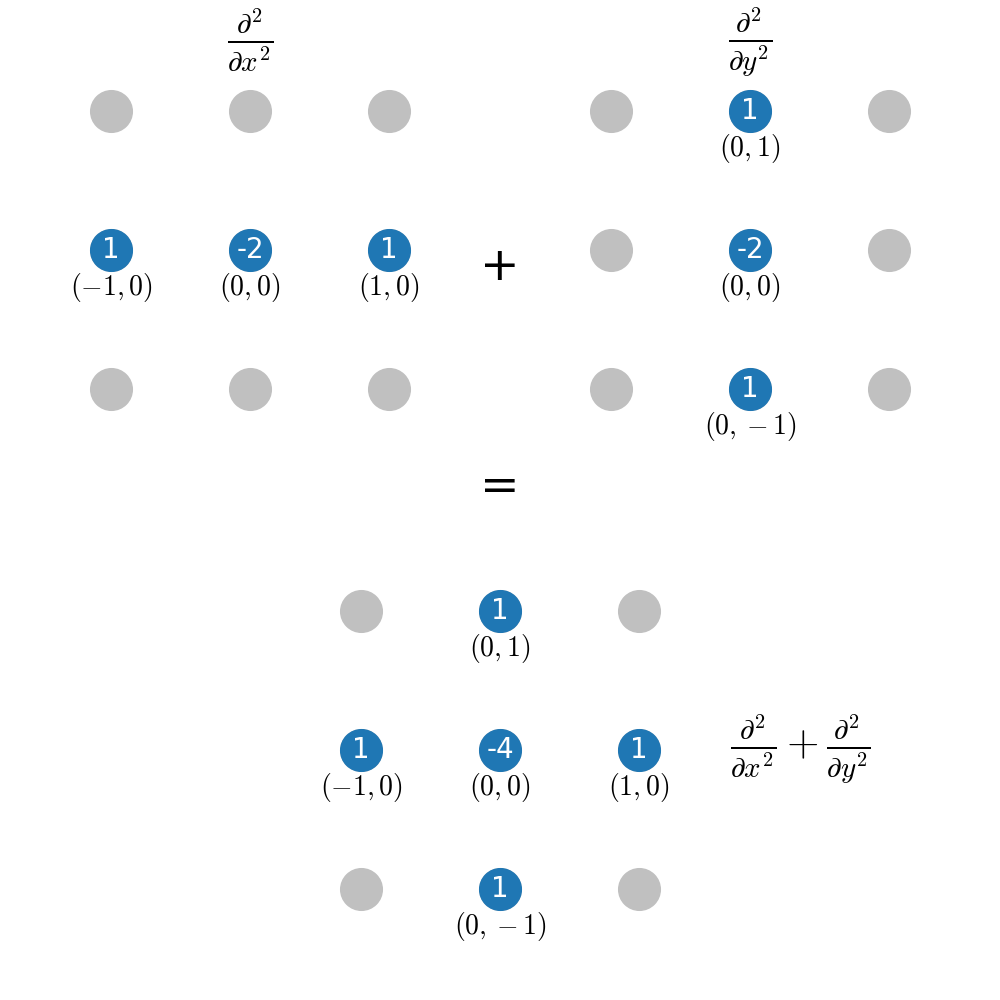

Theory
======

As the name *findiff* suggests, the package uses finite difference
schemes to approximate differential operators numerically. In this
section, we describe the method in some detail.

Notation
--------

In this section, we are talking about functions on equidistant grids.
Consider the following figure.

In 1D, instead of a continuous variable :math:`x`, we have a set
of grid points

.. math::

    x_i = a + i \Delta x

for some real number :math:`a` and grid spacing :math:`\Delta x`. In many
dimensions, say 3, we have

.. math::

    x_{ijk} = \left(
    \begin{matrix}
         x_i \\
         y_j \\
         z_k \\
    \end{matrix}
    \right) =
     \left(
    \begin{matrix}
         a_x + i \Delta x \\
         a_y + j \Delta y \\
         a_z + k \Delta z \\
    \end{matrix}
    \right)

For a function *f* given on a grid, we write

.. math::

    f_{ijk} = f(x_{ijk})

The generalization to *N* dimensions is straight forward.

The 1D Case
------------

Say we want to calculate the *n*-th derivative :math:`\frac{d^n f}{dx^n}` of
a function of a single variable and let the function be given on an equidistant
grid. The basic idea behind finite difference is to approximate the true
derivative at some point :math:`x_k` by a linear combination of the function
values around :math:`x_k`.

.. math::

    \left(\frac{d^n f}{dx^n}\right)_k = f^{(n)}_k \approx \sum_{j \in A} c_{j} f_{k+j}

where *A* is a set of offsets, such that :math:`k+i` are
indices of grid points neighboring :math:`x_k`. Specifically, let
:math:`A=\{-p, -p+1, \ldots, q-1, q\}` for positive integers :math:`p, q \ge 0`.
For instance, for :math:`p=q=1`, we would use the following (blue)
grid points when evaluating a derivative at :math:`x_k`:

.. figure::
    images/stencil_1d_center.png

This is a symmetric stencil. Obviously, this does not work if :math:`x_k` is at the boundary
of the grid, because there would be no other points either to the
left or to the right. In that case, we can use one-sided stencil, like
the following forward-stencil (here, :math:`p=0, q=3`), where we
evaluate the derivative at :math:`x_0` with four points in total.

For :math:`f_{k+i}` we can insert the Taylor expansion around :math:`f_k`:

.. math::

    f_{k+j} = f_k + j \Delta x f^{(1)}_k + \frac{1}{2!} (j \Delta x)^2 f^{(2)}_k + \ldots = \sum_{\alpha=0}^\infty \frac{1}{\alpha !} (j \Delta x)^\alpha f^{(\alpha)}_k \quad.

So we have

.. math::
    f^{(n)}_k \approx\sum_{\alpha=0}^\infty \underbrace{\left(\sum_{j=-p}^q c_{j} j^\alpha \
    \right) \frac{\Delta x^\alpha}{\alpha !}}_{M_\alpha}  f^{(\alpha)}_k = \sum_{\alpha=0}^\infty M_\alpha  f^{(\alpha)}_k

Now let us demand that :math:`M_\alpha = \delta_{n\alpha}`, where :math:`\delta_{n\alpha}` is the
Kronecker symbol. In other words, we have the equations (one for each :math:`\alpha \ne k`):

.. math::

    M_\alpha = 0 = \frac{\Delta x^\alpha}{\alpha !} \sum_{j=-p}^q c_{j} j^\alpha

or

.. math::

    \sum_{j=-p}^q c_{j} j^\alpha = 0

and one equation for :math:`\alpha = k`

.. math::
   M_\alpha = 1 = \frac{\Delta x^\alpha}{\alpha !} \sum_{j=-p}^q c_{j} j^\alpha

or

.. math::

    \sum_{j=-p}^q c_{j} j^\alpha =  \frac{\alpha !}{\Delta x^\alpha}

If we take enough terms (:math:`p, q` high enough), we can make more and more terms
in the Taylor expansion vanish, thereby increasing the accuracy or our approximation.

For example, choosing a symmetric scheme with :math:`p=q=1` for
the second derivative, we get the equation system (with :math:`\Delta x = 1`)

.. math::
    \left(
    \begin{matrix}
     1 & 1 & 1 \\
    -1 & 0 & 1 \\
     1 & 0 & 1
    \end{matrix}
    \right)
    \left(
    \begin{matrix}
    c_{-1} \\ c_0 \\ c_1
    \end{matrix}
    \right)
    =
    \left(
    \begin{matrix}
    0 \\ 0 \\ 2
    \end{matrix}
    \right)

which has the solution

.. math::

    c_{-1} = c_1 = 1, \quad c_0 = -2

so that

.. math::

    \left(\frac{d^2 f}{dx^2}\right)_k \approx
    \frac{f_{k-1} - 2f_k + f_{k+1}}{\Delta x^2}

This expression has second order accuracy, i.e. the error
is getting smaller as :math:`{\cal O}(\Delta x^2)`.

We can visualize this approximation compactly by
inserting the coefficients in the stencil plot:

.. figure::
    images/stencil_1d_center_with_weights.png

Or, even more compactly, dropping the unused grid points
and writing only the offsets from :math:`x_k`:

Multiple Dimensions
-------------------

For functions of several variables, the same idea of approximating
(now partial) derivatives as linear combination of neighboring grid points
can be applied. It is just getting more cumbersome to write it all down, because
a priori, in multiple dimensions, there is much more degree of freedom for
choosing the shape of the stencil. However, it turns out that in most cases
the "ideal" stencil is just the superposition of stencils in 1D. As an
example, consider the 2D Laplacian

.. math::
    \frac{\partial^2}{\partial x^2} + \frac{\partial^2}{\partial y^2}

Our grid is now two-dimensional and we can reuse the stencil for the
second derivative in 1D from the previous section:

It is not obvious that a superposition like this gives the
"best" stencil in 2D with nearest neighbors only. However,
it can be shown that this is indeed the case.

